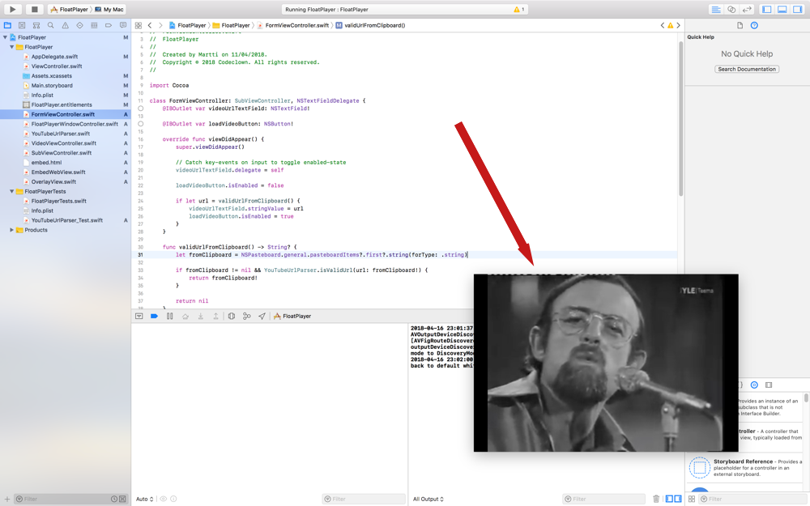

      
    <strong>FloatPlayer</strong> 
    Have a floating YouTube video on your screen

 

# FloatPlayer

FloatPlayer is a simple Mac app that plays a floating YouTube-video on your screen. The player is visible even on top of full-screen apps.

It's also completely open source.

## Download

[**Download v0.1**](https://github.com/codeclown/FloatPlayer/releases/download/v0.1/FloatPlayer.zip) (3.2mb)

Requires macOS High Sierra.

## Have a problem?

Please file an issue if you encounter any problems.

Feature requests are also welcome, please file an issue for them as well.

## Contributing

Contributions very welcome.

## License

The source code and related assets are licensed under [GNU GPLv3](https://choosealicense.com/licenses/gpl-3.0/).
